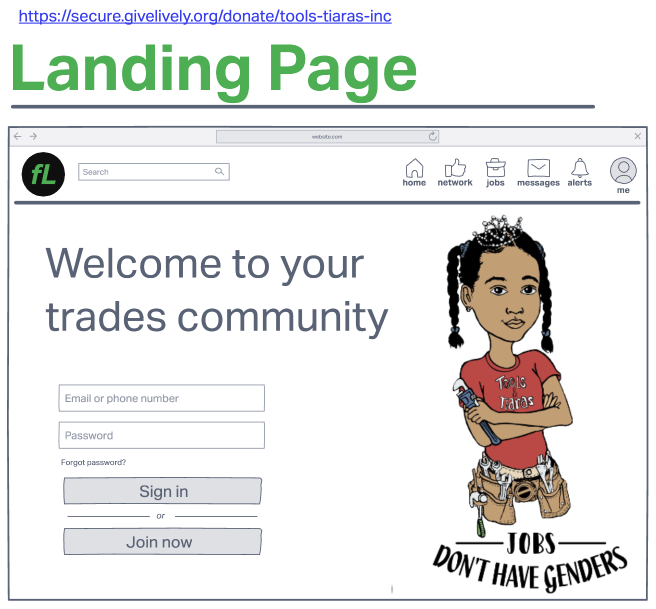
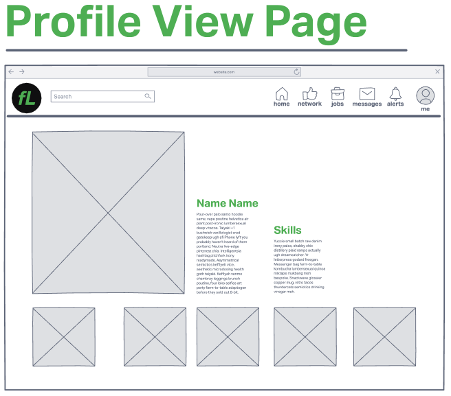

# FitzList: Where folks in the trade Link In
***
## Description
A remake of LinkedIn but with the construction and trade worker in mind. Users can register to add skills, related projects, references, and more info to better build a profile for prospective employers.
***
## Technologies Used

- HTML5
- CSS3
- JavaScript
- Express
- Express-Sessions
- MongoDB
- Mongoose
- Trello
- Invision
- Figma
- Git/Github
- Heroku Deployed
***
## Screenshots

    

 
***
### Production version

***
## Deployed Website
[lets go find that job...](https://krsnamara.github.io/FitzList/) to visit deployed app! 
***
## Future Enhancements
- Adding a feature that allows users to create a 'Looking for work' post
- Adding a feature that allows a users to comment on others project photos
- Adding a feature that allows a user to save jobs postings
- Adding a feature that allows a user to save other users profiles and interact via notes

